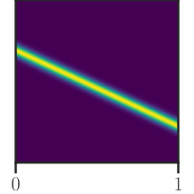
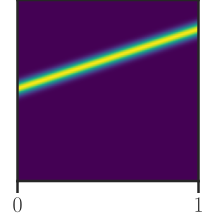
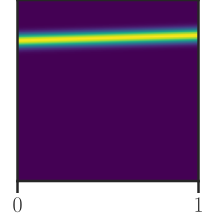
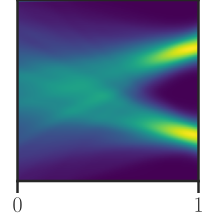
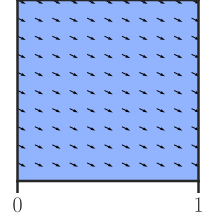
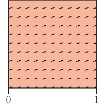
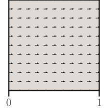

## CFM: $u^{cond}(x,t,z)$ to $u(x,t)$ is less easy

    <mjx-container class="MathJax CtxtMenu_Attached_0" jax="CHTML" style="font-size: 113.2%; position: relative;" display="true" tabindex="0" ctxtmenu_counter="309"><mjx-math display="true" style="margin-left: 0px; margin-right: 0px;" class="MJX-TEX" aria-hidden="true"><mjx-mi class="mjx-i"><mjx-c class="mjx-c1D45D TEX-I"></mjx-c></mjx-mi><mjx-mo class="mjx-n"><mjx-c class="mjx-c28"></mjx-c></mjx-mo><mjx-mi class="mjx-i"><mjx-c class="mjx-c1D465 TEX-I"></mjx-c></mjx-mi><mjx-mo class="mjx-n"><mjx-c class="mjx-c2C"></mjx-c></mjx-mo><mjx-mi class="mjx-i" space="2"><mjx-c class="mjx-c1D461 TEX-I"></mjx-c></mjx-mi><mjx-texatom texclass="ORD"><mjx-mo class="mjx-n"><mjx-c class="mjx-c7C"></mjx-c></mjx-mo></mjx-texatom><mjx-mi class="mjx-i"><mjx-c class="mjx-c1D467 TEX-I"></mjx-c></mjx-mi><mjx-mo class="mjx-n" space="4"><mjx-c class="mjx-c3D"></mjx-c></mjx-mo><mjx-msup space="4"><mjx-mi class="mjx-i"><mjx-c class="mjx-c1D467 TEX-I"></mjx-c></mjx-mi><mjx-script style="vertical-align: 0.413em;"><mjx-texatom size="s" texclass="ORD"><mjx-mo class="mjx-n"><mjx-c class="mjx-c28"></mjx-c></mjx-mo><mjx-mi class="mjx-i"><mjx-c class="mjx-c1D456 TEX-I"></mjx-c></mjx-mi><mjx-mo class="mjx-n"><mjx-c class="mjx-c29"></mjx-c></mjx-mo></mjx-texatom></mjx-script></mjx-msup><mjx-mo class="mjx-n"><mjx-c class="mjx-c29"></mjx-c></mjx-mo></mjx-math><mjx-assistive-mml unselectable="on" display="block"><math xmlns="http://www.w3.org/1998/Math/MathML" display="block"><mi>p</mi><mo stretchy="false">(</mo><mi>x</mi><mo>,</mo><mi>t</mi><mrow data-mjx-texclass="ORD"><mo stretchy="false">|</mo></mrow><mi>z</mi><mo>=</mo><msup><mi>z</mi><mrow data-mjx-texclass="ORD"><mo stretchy="false">(</mo><mi>i</mi><mo stretchy="false">)</mo></mrow></msup><mo stretchy="false">)</mo></math></mjx-assistive-mml></mjx-container>
    <mjx-container class="MathJax CtxtMenu_Attached_0" jax="CHTML" style="font-size: 113.2%; position: relative;" display="true" tabindex="0" ctxtmenu_counter="310"><mjx-math display="true" style="margin-left: 0px; margin-right: 0px;" class="MJX-TEX" aria-hidden="true"><mjx-mi class="mjx-i"><mjx-c class="mjx-c1D45D TEX-I"></mjx-c></mjx-mi><mjx-mo class="mjx-n"><mjx-c class="mjx-c28"></mjx-c></mjx-mo><mjx-mi class="mjx-i"><mjx-c class="mjx-c1D465 TEX-I"></mjx-c></mjx-mi><mjx-mo class="mjx-n"><mjx-c class="mjx-c2C"></mjx-c></mjx-mo><mjx-mi class="mjx-i" space="2"><mjx-c class="mjx-c1D461 TEX-I"></mjx-c></mjx-mi><mjx-mo class="mjx-n"><mjx-c class="mjx-c29"></mjx-c></mjx-mo></mjx-math><mjx-assistive-mml unselectable="on" display="block"><math xmlns="http://www.w3.org/1998/Math/MathML" display="block"><mi>p</mi><mo stretchy="false">(</mo><mi>x</mi><mo>,</mo><mi>t</mi><mo stretchy="false">)</mo></math></mjx-assistive-mml></mjx-container>
    
    
    
    
⇒

    
    <mjx-container class="MathJax CtxtMenu_Attached_0" jax="CHTML" style="font-size: 113.2%; position: relative;" display="true" tabindex="0" ctxtmenu_counter="311"><mjx-math display="true" style="margin-left: 0px; margin-right: 0px;" class="MJX-TEX" aria-hidden="true"><mjx-msup><mjx-mi class="mjx-i"><mjx-c class="mjx-c1D462 TEX-I"></mjx-c></mjx-mi><mjx-script style="vertical-align: 0.413em;"><mjx-texatom size="s" texclass="ORD"><mjx-texatom texclass="ORD"><mjx-mi class="mjx-n"><mjx-c class="mjx-c63"></mjx-c><mjx-c class="mjx-c6F"></mjx-c><mjx-c class="mjx-c6E"></mjx-c><mjx-c class="mjx-c64"></mjx-c></mjx-mi></mjx-texatom></mjx-texatom></mjx-script></mjx-msup><mjx-mo class="mjx-n"><mjx-c class="mjx-c28"></mjx-c></mjx-mo><mjx-mi class="mjx-i"><mjx-c class="mjx-c1D465 TEX-I"></mjx-c></mjx-mi><mjx-mo class="mjx-n"><mjx-c class="mjx-c2C"></mjx-c></mjx-mo><mjx-mi class="mjx-i" space="2"><mjx-c class="mjx-c1D461 TEX-I"></mjx-c></mjx-mi><mjx-mo class="mjx-n"><mjx-c class="mjx-c2C"></mjx-c></mjx-mo><mjx-msup space="2"><mjx-mi class="mjx-i"><mjx-c class="mjx-c1D467 TEX-I"></mjx-c></mjx-mi><mjx-script style="vertical-align: 0.413em;"><mjx-texatom size="s" texclass="ORD"><mjx-mo class="mjx-n"><mjx-c class="mjx-c28"></mjx-c></mjx-mo><mjx-mi class="mjx-i"><mjx-c class="mjx-c1D456 TEX-I"></mjx-c></mjx-mi><mjx-mo class="mjx-n"><mjx-c class="mjx-c29"></mjx-c></mjx-mo></mjx-texatom></mjx-script></mjx-msup><mjx-mo class="mjx-n"><mjx-c class="mjx-c29"></mjx-c></mjx-mo></mjx-math><mjx-assistive-mml unselectable="on" display="block"><math xmlns="http://www.w3.org/1998/Math/MathML" display="block"><msup><mi>u</mi><mrow data-mjx-texclass="ORD"><mrow data-mjx-texclass="ORD"><mi data-mjx-auto-op="false">cond</mi></mrow></mrow></msup><mo stretchy="false">(</mo><mi>x</mi><mo>,</mo><mi>t</mi><mo>,</mo><msup><mi>z</mi><mrow data-mjx-texclass="ORD"><mo stretchy="false">(</mo><mi>i</mi><mo stretchy="false">)</mo></mrow></msup><mo stretchy="false">)</mo></math></mjx-assistive-mml></mjx-container>
    
    
    
    
    
⇒

    
?

  
