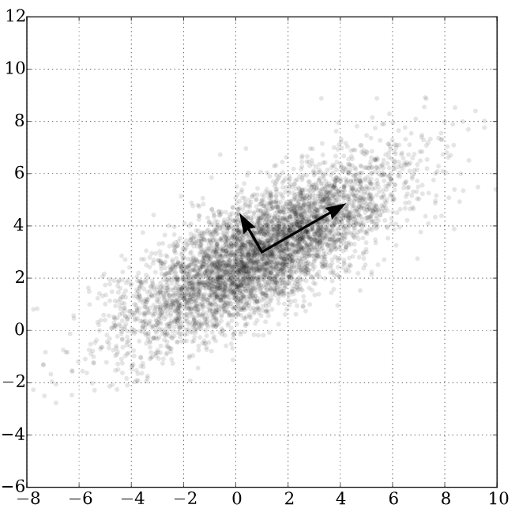
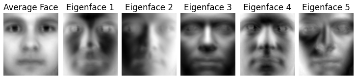
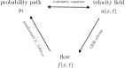
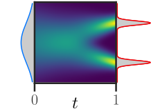
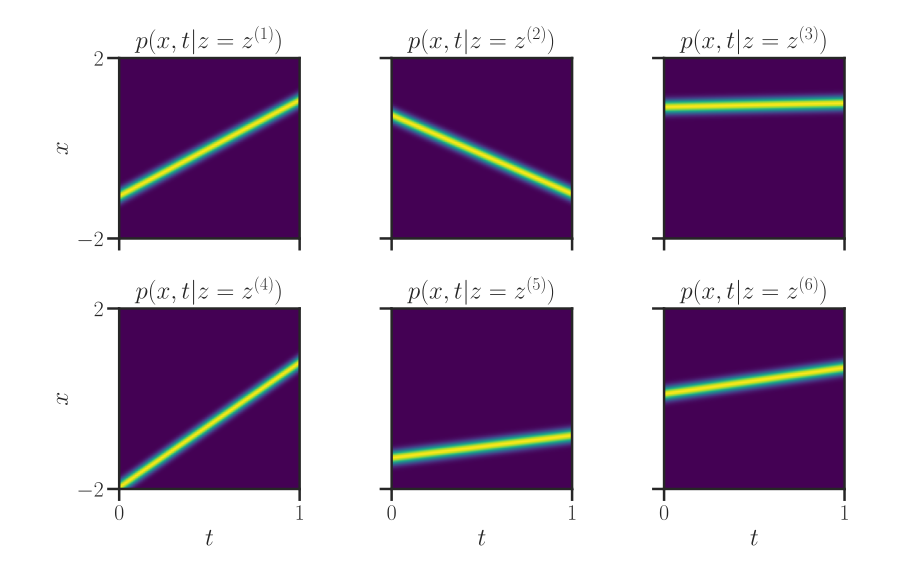
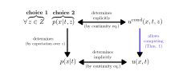
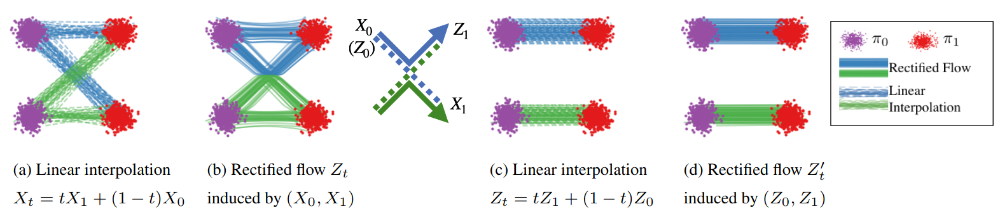
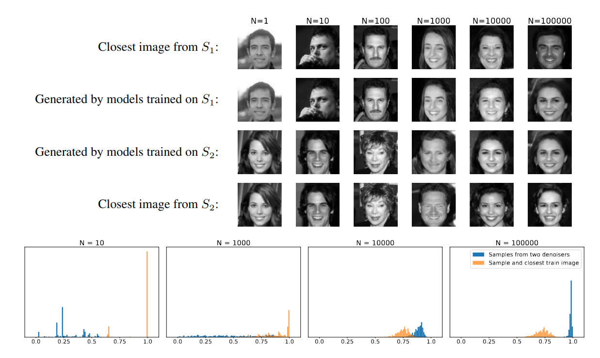

(replaced)

---
src: pages/overview.md
---
(replaced)
(say what)

---

# Introduction

---

## Disclaimer

- I won't show any generated images
- I won't cover advanced approaches
- Focus: understanding the concepts

 CFM [Blogpost](https://dl.heeere.com/cfm/) (ICLR Blogpost track) and CFM playground

---

## <w>Generative Modeling</w> = <w>Density Estimation</w>

<v-clicks>

Given some dataset $\{x_i\}_{i=1}^N$

supposed drawn i.i.d. from an unknown distribution $P(X)$ … or $p(X)$ or $p(X=x)$ or $p(x)$

try to recover $p(X)$

</v-clicks>

---

## Generative Model vs Discriminative Model

- Discriminative: $P(Y|X)$
- Generative: $P(X,Y)$
- Generative: $P(X)$

---

# A quick tour of generative models

---

## <w>Principal Components Analysis</w> (PCA)

Find an orthogonal subspace (lower dimension)\
maximizing the captured variance\
i.e. minimizing the residual variance\
i.e. minimizing the reconstruction error 

$$\argmin_{\{z_i\}_i, W} \sum_i || x_i - W z_i ||_2^2$$

---
layout: anim
spec: 'svg | #gpcadir | #gbary | #got | #gequiv | .as-bary | #gcaption'
class: text-center
---

## Aside: PCA as Wasserstein Minimizer + 1-Barycenter

<InlineSvg2 wrap class="float-right w600px m-auto patchblack" src="./media/mlot-pca-wassertein.svg" />

$$\argmin_{\{z_i\}_i, W} \sum_i || x_i - W z_i ||_2^2$$

$W$ the subspace \
(fixed dimension)\
\
$z_i$ the barycenter\
 (fixed number of Diracs)

---
layout: two-cols
---

## Probabilistic Graphical Models, Bayesian Networks, ...

Suppose a structured probability distribution\
i.e. a (probablistic) generative story

$$P_\theta(X)$$

based on conditional probabilities and latent variables.

$$P_\theta(X,...) = \prod_{var} P_\theta(var | parents(var))$$

::right::

<InlineSvg2 wrap class="patchblack" src="./media/vltamm-model.svg"/>

---

## <w href="Energy-based_model">Energy-Based Models</w>

<v-clicks>

Replace the probability (that would be constrained to be normalized)\
by an energy (un-normalized negative log-probability)

$$P_{\theta}(x)=\frac{1}{Z(\theta)} \exp(- E_{\theta}(x))$$

$Z(\theta)$: normalization constant, partition function, ...

$$Z(\theta):=\int_{x\in X}\exp(- E_{\theta}(x))d x$$

Challenge: find a  way to work around computing $Z$

</v-clicks>

<c>JMLR 2003, Hinton</c>

---
layout: anim
spec: '.footnotes'
---

## Autoencoders (AE), <w href="Variational_autoencoder">Variational AE</w> (VAE)

<v-clicks>

PCA: $\argmin_{\{z_i\}_i, W} \sum_i || x_i - W z_i ||_2^2$ ... ⇒ Reconstruction-error minimizer

Autoencoder (AE): A non-linear version of PCA
- replace $W z_i$ by $Dec_\theta(z_i)$ ... no simple projection ($W^T$) to get $\{z\}_i$
- need to estimate all $\{z_i\}_i$ (as in any Bayesian Network) ⇒ trick: "amortize" (share the cost) by
  - replacing the estimation of all $\{z_i\}_i$
  - by a $z_i$-guesser... $z_i = Enc_{\theta'}(x_i)$

$\text{we have   } || x_i - W z_i ||_2^2 = - \log( \exp (- || x_i - W z_i ||_2^2)) = K - λ \cdot \log \mathcal{N}(μ=W z_i, σ=1)(x_i))$

PCA = Maximum Likelihood Estimator (minimizer of "constant minus log-likelihood")

VAE: A probabilistic version of non-linear PCA... $z_i \sim \mathcal{N}(Enc_{\theta'})$ + prior[^1]   (maximum a posteriori)

[^1]:
    usually $\mathcal{N}(0,Id)$... for **each** $z_i$, but/so, NO, the distribution of all the $\{z_i\}_i$ taken together is not $\mathcal{N}(0,Id)$

</v-clicks>

---

## Generative Adversarial Networks (GANs)

Like a VAE

- still a (small) latent "noise" space
- still a decoder, called generator

But

- likelihood free
  - not (explicitly) maximizing the likelihood
  - using a discriminator: estimate the likelihood ratio between real and fake
  - or, in OT, minimizing the Wasserstein distance
    - using a critic: Kantorovich-Rubinstein duality
- a latent representation that is really $\mathcal{N}(0,Id)$

---

## In practice

- VAE + GANs
- VAE + ...

---

# A focus on flow approaches

---
layout: anim
---

## Normalizing Flows

<InlineSvg2 wrap class="patchblack m-auto w-700px" src="./media/T_theta_pushforward.svg"/>

Definition (push-forward): if $x \sim p_0$ then $T(x) \sim T_{\#}p_0$ <s0/>

Normalizing flow (intuition):
  - denoting $p_{gen} = T_{\#}p_0$
  - locally, if $T$ compresses the space by a factor 42, then $p_{gen}(T(x)) = 42 \cdot p_0(x)$ <st/>
  - formally, change of variable, $p_{gen}(T(x)) = |det(J_{T^{-1}}(x))| \cdot p_0(x)$ *(determinant of the jacobian of $T^{-1})$* <st/>

Principle: parametrize and learn $T$... so that its inverse exists (and has an easy jacobian det).

---
layout: anim
---

## Normalizing Flows, with composed functions

<InlineSvg2 wrap class="patchblack m-auto w-700px" src="./media/T_theta_pushforward_phis.svg"/>
<s0/>

Learn a deep $T$, i.e.,

$$T = \phi_1 \circ \phi_2 \circ ... \circ \phi_K$$
<st/>

Chain rule of change of variable,

$$|det(J_{T^{-1}}(x))| = \prod_k |det(J_{\phi_k^{-1}}(x))|$$
<st/>

Principle: compose invertible blocks (with easy jacobian det)

---

## Continuous Normalizing Flows

<v-switch>
<template #1><InlineSvg2 wrap class="patchblack m-auto w-700px pt-12px" src="./media/T_theta_pushforward.svg"/></template>
<template #2><InlineSvg2 wrap class="patchblack m-auto w-700px pt-12px" src="./media/T_theta_pushforward_phis.svg"/></template>
<template #3><InlineSvg2 wrap class="patchblack m-auto w-700px" src="./media/T_theta_pushforward_continuous.svg"/></template>
<template #5><InlineSvg2 wrap class="patchblack m-auto w-700px" src="./media/T_theta_pushforward_continuous_reverse.svg"/></template>
</v-switch>

Pushing to the limit
- infinitely many infinitely-small steps
- making depth continuous $k \mapsto t$
- replacing $\phi_k(x)$ by $u(x, t)$, or $u_t(x)$

Continuous Normalizing Flow
- easier: less constraints on $u$ than $\phi$ <c>bounded?</c>

<v-click at="5">

Forward and reverse ODE

</v-click>

---

## Continuous Normalizing Flows: visual summary

<iframe class="titleonly darkinvert m-auto h-360px! w-360px!" src="ot-flow-1d.html#loop1" frameborder="0" scrolling="no"></iframe>

---

## Continuous Normalizing Flows: "limitation"

<iframe class="titleonly darkinvert m-auto h-360px! w-360px!" src="ot-flow-1d.html#loop3" frameborder="0" scrolling="no"></iframe>

The flow is unspecified!  (there is an infinity of equally good solutions)

---

## Probability paths, velocity fields (and flows)

<iframe class="darkinvert titleonly" src="ot-flow-1d.html"></iframe>
<video src="./media/traj.mp4" style="position: absolute; left: 30px; bottom: 50px; width: 125px;" autoplay loop onclick="this.controls = true"></video>

Continuity Equation / Transport Equation

$$\partial_t p_t + \nabla\cdot u_t p_t = 0$$

---

## Diffusion: denoising diffusion probabilistic models (DDPM)

### Principle {.mt--30px}
  - progressively noise you data
  - use that data to learn an infinitesimal denoiser

<v-click>

### Actually
  - a VAE with successive latent representations[^1]
  - learning a velocity field (notation trap: $t \in \llbracket T, 0\rrbracket$ instead of $t \in [0, 1]$)
  - specifying a unique probability path (but stochastic flow) 
  - effectively supervising at every step (vs CNF)

[^1]: ... the latent space dimension is the same as the data space dimension (like CNF, contrary to PCA, GAN, VAE)

</v-click>

---
src: pages/overview.md
---
(replaced)

---
layout: cover
background: ./external-images/2025-02-24-wave3.jpg
---

# Conditional Flow Matching (CFM)

---

## Visuals

    <iframe class="darkinvert" style="aspect-ratio: 1; width: calc(100% / ( 1 + 2 * var(--ar)));" src="ot-flow-1d.html#loop9" frameborder="0" scrolling="no"></iframe>
    
    <iframe class="darkinvert" style="aspect-ratio: var(--ar); margin: -50px -5px 0; width: calc(100% * var(--ar) / ( 1 + 2 * var(--ar)));" src="u-anim.html" frameborder="0" scrolling="no"></iframe>

---

## Conditional Flow Matching (CFM) Principles

- Fully specify a probability path / velocity field / flow (like diffusion, unlike CNF)
- Use a ordinary (non-stochastic) differential equation (like CNF, unlike diffusion)

Solution ?
- introduce an arbitrary conditioning variables $z$
- specify the flow as an aggregation of conditional flows

Before diving into the details, let's look at one algorithm.

---

## Typical CFM algorithm

### Design choices

<v-clicks>

- conditioning variable $z$ is a pair
  - a *source* point, typically from $\mathcal{N}(0,1)$
  - a *target* point, typically form the (training) dataset
- conditional probability path/flow is a straight constant-velocity (OT between two points)

</v-clicks>

<v-clicks>

### Algorithm

$$
\begin{align*}
z_0 &\sim \mathcal{N}(0, I) \\
z_1 &\sim Dataset \\
t & \sim Uniform([0, 1]) \\
x & = t\cdot z_1 + (1-t) \cdot z_0 \\
\text{SGD step on $θ$ with loss:  } &  || u_θ(x, t) - \frac{z_1 - z_0}{1-t} ||_2^2
\end{align*}
$$

That's it! *(up to practical hacks and a few days of training)*

</v-clicks>

---

## CFM: Does it works? the "inversion", path un-mixing

<iframe class="titleonly darkinvert m-auto h-400px! w-400px!" src="cfm-1d.html#inter1" frameborder="0" scrolling="no"></iframe>

---

## CFM: Design choices

<v-clicks>

### Decide on $p_0$, typically $\mathcal{N}(0,I)$

### Decide on the conditioning variable (and its distribution), e.g.
- $z$ is a pair $(x_0, x_1)$
- $z$ is a target point $x_1$
- $z$ is a minibatch of source and target
- $z$ is a pair, constrained by some clusters

### Decide on the conditional "flow"
- conditional probability path $p_t(x | z)$ (or $p(x,t | z)$)
- and associated velocity field $u^{cond}(x, t)$

(under marginal constraints, on $p(x,t)$)

</v-clicks>

---

## CFM: $p(x,t| z)$ (conditional) to $p(x,t)$ is easy 

    
    <video style="width: calc(100% * (1 - var(--r)));border-left:1px solid black" autoplay="" loop="" onclick="this.controls = true" src="./media/a/a_accumulate_pcond.mp4" frameborder="0" scrolling="no"></video>

$$p(x, t) = \int p(x,t|z)p(z) dz = E_z \left[p(x,t|z)\right]$$

---
src: pages/montage-ucond-not-easy.md
---
(replaced, too long)

---

---
layout: anim
---

## CFM: Closed form expression (Theorem 1)

$$\forall t, \forall x,$$

$$u(x,t)  = E_{z|x, t}[u^{cond}(x,t,z)]$$

<s0/>

(also written as)

$$\forall \, t, \forall \, x,$$
$$u(x,t) = \int_z u^{cond}(x,t,z) p(z|x,t) $$

<st/>
(or bayes)

$$\forall \, t, \forall \, x,$$
$$u(x,t) = \int_z u^{cond}(x,t,z) \frac{p(x,t|z)p(z)}{p(x,t)} = E_z\left[\frac{u^{cond}(x,t,z) p(x,t|z) } {p(x,t)}\right]  = E_z\left[\frac{u^{cond}(x,t,z) p(x,t|z) } {\sum_{z'}p(x,t|z')p(z')}\right]$$

---

## CFM: Some intuition on the loss

$$L_{CFM} = ...$$

Least squares!

---

## CFM playground

<iframe class="onlyiframe darkinvert" style="--w: 600; --h: 800; width: 100%;" src="cfm-1d.html#playground" frameborder="0" scrolling="no"></iframe>

---
src: pages/overview.md
---
(replaced)

---

# Optimal Transport and CFM

---

## Links with OT: OT-CFM

### "OT-CFM" (e.g. TMLR2024, https://arxiv.org/abs/2302.00482)
- use minibatch OT to create pairs
- less un-mixing to do
- may improve training stability

Intuition: OT pre-unmixes, given also straighter paths

Q: why not do directly OT? {v-click}

---

## Links with OT: Recified Flow

### Rectified Flows (https://arxiv.org/pdf/2209.03003)
- do CFM to unmix
- relearn with the unmixed coupling
- iterate

Intuition: make paths straight, closer to OT, faster to sample

Q: why not do directly OT? {v-click}

---

## Underlying links between Optimal Transport and CFM

- Kantorovich-Rubinstein duality is $u(x, t)$ without depending on $t$
- "Everything" points towards making CFM closer to OT
  - less mixing is easier to learn
  - straighter path lead to faster sampling (incl. single-step generation)

Q: why not do directly OT, learning the Monge Map? {v-click}

---

# Generalization for Generative Models

---

## Modern Generative Models: performance measures

### Desired goals

- measure sample quality
- avoid mode collapse and memorization

<v-click>

### Typically

- FID (Fréchet inception distance), between generated and training data
  - Wasserstein in some in a feature space
  - with a gaussian approximation of each dataset
- "recall": coverage of the training set
- "precision": only generate good (i.e. coverage of gen set by training set)

The goal is missed.
</v-click>

---

## Generalization bounds?

On $L(train) - L(test)$ ($KL$, $W$, ...)

...

NB
- closed-form solution of CFM says we generate only training points (memorization)
- small gaussian noise present in CFM formulations don't change that <c>(just simplify the maths, no Dirac, absolute continuity)</c>

---

## Generalization vs Creativity
*(e.g. https://arxiv.org/pdf/2310.02557 next slide)*

- ML-type Generalization
  - memorization can be observed with big models and "small" data
  - no memorization with big data
  - it seems, no double descent (better generalization with bigger models, lottery ticket etc)
- Creativity
  - open/ill-posed problem
  - inductive bias
  - for images

---

---
src: pages/overview.md
---
(replaced)

---
routeAlias: playground
---

## CFM [Blogpost](https://dl.heeere.com/cfm/) (ICLR Blogpost track) and CFM playground

<iframe class="onlyiframe darkinvert" style="--w: 600; --h: 800; width: 100%;" src="cfm-1d.html#playground" frameborder="0" scrolling="no"></iframe>

---
routeAlias: end
src: pages/title.md
background: ./external-images/2025-02-24-landscape1-03.jpg
class: thanks
---
## Thanks
